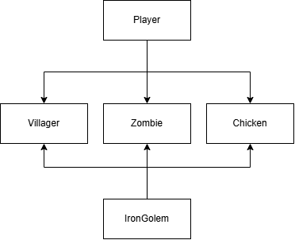
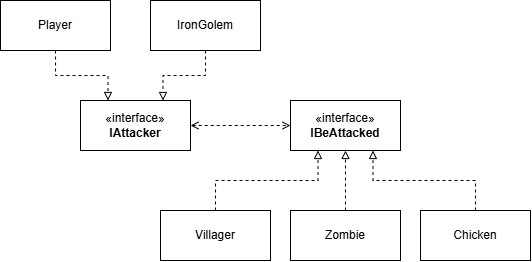

# 三、依赖倒置原则

> _定义：_ 依赖倒置原则 (Dependency Inversion Principle) 要求：
>
> 1. 高层模块不应依赖底层模块，二者都应该依赖抽象；
> 2. 抽象不应依赖细节，细节应该依赖抽象（针对接口编程，不针对实现编程）；

设想 "玩家攻击实体" (`Player` attacks `Entity`) 的场景。这个场景下，`Player` 为主动方，是高层模块，`Entity` 为被动方，是低层模块。`Entity` 是一个抽象类，有多种具体的实现。假设我们现在只有 `Villager`、`Zombie` 和 `Chicken` 三种 `Entity`。

_需求如下：_ 

- `Villager` 和 `Zombie` 的击退效果 (`knockback`) 和造成伤害 (`damage`) 不同；
- 不同实体有其特殊的被攻击效果，如 `Zombie` 被攻击后会添加仇恨值 (`addHate()`)，`Chicken` 被攻击后直接死亡。

## 3.1 违反依赖倒置原则的写法

_`Entity` 抽象类与其实现类_

```java
abstract class Entity {
    protected double health;

    protected void die() {
        engine.clear(this);
    }

    public void damage(double amt) {
        health = Math.max(0, health - amt);
    }

    public void getKnockback(double amt) {
        // ... 击退逻辑
    }

    // 攻击逻辑
    public abstract void attack(Entity e);
}

class Villager extends Entity { 
    // 村民特有逻辑
}

class Zombie extends Entity { 
    public void addHate(Entity e) {
        // 添加仇恨值
    } 
}

class Chicken extends Entity { 
    public void dropItem(Item item) {
        // 掉落物品
    }
}
```

_`Player` 类_

```java
// 玩家
public class Player extends Entity {
    @Override
    private void attack() {
        if (e instanceof Villager) {
            ((Villager) e).getKnockback(10);
            ((Villager) e).damage(2);
        } else if (e instanceof Zombie) {
            ((Zombie) e).getKnockback(5);
            ((Villager) e).damage(2);
            ((Zombie) e).addHate(this);
        } else if (e instanceof Chicken) {
            ((Chicken) e).die();
            ((Chicken) e).dropItem(new ChickenMeat());
        }
    }
}
// 铁傀儡
public class IronGolem {
    @Override
    private void attack() {
        if (e instanceof Villager) {
            ((Villager) e).die();
        } else if (e instanceof Zombie) {
            ((Zombie) e).getKnockback(20);
            ((Villager) e).damage(10);
            ((Zombie) e).addHate(this);
        } else if (e instanceof Chicken) {
            ((Chicken) e).die();
            ((Chicken) e).dropItem(new ChickenMeat());
        }
    }
}
```

**问题分析：**

1. _高层模块依赖具体实现：_ `Player` 和 `IronGolem` 类直接依赖 `Villager`、`Zombie`、`Chicken` 等具体类，耦合严重；
2. _违反开闭原则：_ 每新增一种实体类型，都需要修改 `Player` 类添加新的攻击方法；

**类图**

<div style="text-align: center;">
    
</div>

## 3.2 符合依赖倒置原则的写法

_定义抽象接口 `IBeAttacked`_

```java
interface IBeAttacked {
    void beAttacked(IAttacker eAttacker);
}

interface Attacker {
    double giveKnockBack();
    double giveDamage();
    void attack(IBeAttacked eBeAttacked);
}
```

_`Entity` 继承类实现接口_

```java
// 村民
class Villager extends Entity implements IBeAttacked {
    @Override
    public void beAttacked(IAttacker attacker) {
        getKnockback(attacker.giveKnockback());
        damage(attacker.giveDamage());
    }
}

// 僵尸
class Zombie extends Entity implements IBeAttacked {
    @Override
    public void beAttacked(IAttacker attacker) {
        getKnockback(attacker.giveKnockback());
        damage(attacker.giveDamage());
        addHate(attacker.getId());  // 对攻击者添加仇恨
    }
}

// 鸡
class Chicken extends Entity implements IBeAttacked {
    @Override
    public void beAttacked(IAttacker attacker) {
        die();
        dropItem(new ChickenMeat());
    }
}
```

_`Player` 类依赖抽象_

```java
public class Player extends Entity implements IAttacker {

    // 实现 IAttacker 接口
    public double giveKnockback() {
        return 10;
    }

    public double giveDamage() {
        return 2;
    }

    // 关键改进：依赖抽象接口 IBeAttacked，而非具体实现类
    @Override
    private void attack(IBeAttacked target) {
        // 被攻击者自行决定是否调用 giveKnockback 和 giveDamage
        target.beAttacked(this);
    }
}

public class IronGolem extends Entity implements IAttacker {
    public double giveKnockback() {
        return 20;
    }

    public double giveDamage() {
        return 10;
    }

    @Override
    private void attack(IBeAttacked target) {
        target.beAttacked(this);
    }
}

```

**改进要点：**

1. _高、低层模块均依赖对方的抽象，而非具体实现：_ 在这个例子中，`Player` 和 `IronGolem` 都依赖 `IBeAttacked` 抽象，而 `Villager`，`Zombie` 和 `Chicken` 都依赖 `IAttacker` 抽象。攻击者和被攻击者完全解耦；
2. _符合开闭原则：_ 新增攻击者实体，只需要实现 `IAttacker` 接口；新增被攻击者实体，只需要实现 `IBeAttacked` 接口，无需修改各自的类；
3. _职责清晰：_ 每个实体各自决定 “被攻击时发生什么”、“被攻击时对攻击者做什么”，符合单一职责原则；

**核心思想：**

传统思维中，"攻击者" 决定如何攻击 "被攻击者"。而依赖倒置后，"被攻击者" 自己定义被攻击的行为（通过 `beAttacked()` 方法）。这就是"倒置"的含义——**控制权从调用方转移到被调用方**。

同时，`Player` 不再依赖具体的 `Villager`、`Zombie`、`Chicken`，而是依赖抽象的 `IBeAttacked` 接口，这正是依赖倒置原则的精髓：**高层模块和底层模块都依赖抽象**。

**类图**

<div style="text-align: center;">
    
</div>