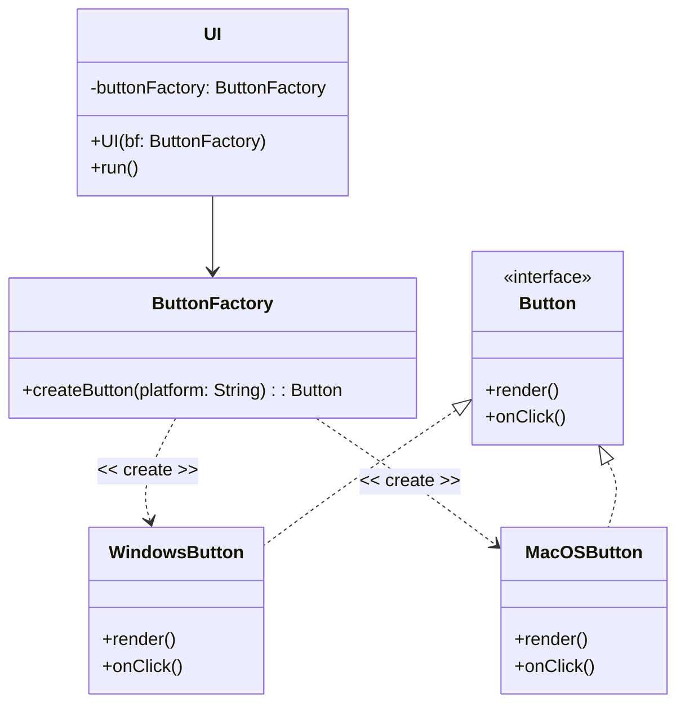

# 一、简单工厂

> _定义：_ 简单工厂模式 (Simple Factory Pattern) 是 一个在父类接收新创建的子类实例时，由一个 **工厂对象** 决定具体创建出哪一种继承子类的设计模式。

设想以下场景。我要设计一套跨平台的系统：在不同的操作系统上，我需要调用不同的底层去实现同一套逻辑。以按钮空间为例，我需要在每个平台都实现 `Button` 接口：

```java
// 假想的UI控件接口，包含渲染方法
interface UIElements {
    void render();
}
// 假想的按钮接口，包含点击回调方法
interface Button extends UIElements {
    void onClick();
}
```

此时，我们可以为不同的平台设计对应的 **按钮** 类，让这个类只实现 `Button` 接口。

```java
// Windows 版本按钮
class WindowsButton implements Button {
    @Override
    void render() { /* ... */ }

    @Override
    void onClick() { /* ... */ }
}

// MacOS 版本按钮
class MacOSButton implements Button {
    @Override
    void render() { /* ... */ }

    @Override
    void onClick() { /* ... */ }
}
```

那么我们该怎么根据平台来决定使用哪个 `Button` 接口的实现类呢？

## 1.1 幼稚方法

一个显而易见的方法如下。在运行时，我们获取到所在平台的信息，并判断实例化哪个类。对应到的UI类逻辑如下：

```java
class UI {
    public void run(){
        Button button;
        String platform = getPlatform();

        switch (platform) {
            case "Windows": // Windows平台，获取Windows版按钮
                button = new WindowsButton();
                break;
            case "MacOS":   // MacOS平台，获取MacOS版按钮
                button = new MacOSButton();
                break;
            case default:
                throw new Exception("Unknown OS.");
        }

        button.render();    // 不论哪个平台，调用对应底层
    }
}
```

不难发现，我们在主程序里进行了一个 `switch` 选择操作。虽然这很简单，但是这种方式引入了一个问题：如果我们想要渲染多个按钮，就会将主程序逻辑撑的非常冗杂。此外，如果我们想添加操作系统平台，就需要 **修改主程序** ，徒增维护的成本，违反了 [开闭原则](../01-design-principles/01-open-closed.md)。

## 1.2 简单工厂

简单工厂的思想是，我们把这份“运行时选择实际类”的逻辑抽离到 **工厂类** 中。这样有两个好处：其一，我们将switch 选择操作封装起来，让主程序专注于与其相关的逻辑实现；其二，我们将“拓展新平台”的地点从主程序迁出，当拓展新平台时只需要修改工厂类，而非主程序，显著提高了可维护性。

**A. `Switch` 写法**

```java
class ButtonFactory {
    // 选择逻辑迁移到工厂！
    Button createButton(String platform) {
        Button button;
        switch (platform){
            case "Windows": // Windows平台，渲染Windows版按钮
                button = new WindowsButton();
                break;
            case "MacOS":   // MacOS平台，渲染MacOS版按钮
                button = new MacOSButton();
                break;
/**         
 *          新代码可以通过拓展工厂来增加        
 *          例子如下：
 *          case "Ubuntu":
 *              button = new UbuntuButton();
 *              break; 
*/
            case default:
                throw new Exception("Unknown OS.");
        }
        return button;
    }
}
```

**B. 反射写法**

```java
// 反射版本
class ButtonFactory {
    String packageName = "com.example.ui.elements"
    Button createButton(String platform) {
        if (null == platform || "".equals(platform)) return null;
        
        try {
            String.format("%s.%sButton", packageName, platform); // 完整包名
            Button button = (Button) Class.forName(className).newInstance();
            return button;
        } catch (Exception e) {
            throw new Exception("Unknown OS.");
        }
    }
}
```

**C. Class 对象写法**

适合需要防止写错时使用。直接传入`clazz`对象名称，在编译时纠错。

```java
class ButtonFactory {
    Button createButton(Class<? extends Button> clazz) { 
        try {
            if (null != clazz) return clazz.newInstance();
        } catch (Exception e) {
            throw new Exception("Unknown OS.");
        }
        return null;
    }
}

```

修改后，我们将 **按钮工厂** 通过构造函数注入进 `UI` 类中。在主程序中，获取按钮则通过工厂的 `createButton` 方法。

```java
class UI {
    private ButtonFactory buttonFactory;

    public UI(ButtonFactory bf) {
        this.buttonFactory = bf;
    }

    // Switch 和 反射写法
    public void run() throws Exception {
        Button button = buttonFactory.createButton(getPlatform());
        button.render(); // 无论添加多少平台，这部分逻辑都不会变！
    }
}
```

_类图如下：_



**总结**

- 适用场景：工厂类负责创建的对象较少时；客户端不需要关心具体创建对象逻辑时；
- 优点：用户传入正确的参数即可获取所需的对象，无需知道创建细节；
- 缺点：工厂类的职责过重，新增产品需要修改其判断逻辑，违背开闭原则。