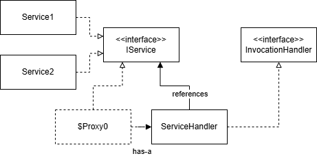

# 七、代理模式

> _定义：_ 代理模式 (Proxy Pattern) 是一种为对象 **提供代理** 以控制该对象的访问，以达到保护、增强该目标对象之目的的设计模式。
>
> _适用场景：_
>
> - 保护目标对象
> - 增强目标对象

**优缺点**

优点：
- 实现 代理对象 与 目标调用对象 的分离，降低系统耦合度，易拓展；
- 保护目标对象，集中目标对象职责；

缺点：
- 造成系统中 类 的数目增加，增加系统复杂度；
- 额外增加的代理对象会降低请求速度；

## 7.1 静态代理

首先，我们需要明确被代理的对象能够提供什么服务。这个服务将会被总结为一个接口。

_服务接口_

```java
class IService {
    void service1(int n);
    double service2(String s);
}
```

其次，被代理的对象和代理它的对象都需要实现该接口。

_被代理的对象_

```java
class Service implements IService {
    public void service1(int n) {/** ... */}
    public void service2(String s) {/** ... */}
}

```

_代理对象_

```java

class ServiceProxy implements IService {

    // 被代理的对象实例
    private Service service;

    public ServiceProxy(Service service) {
        this.service = service;
    }

    public void service1(int n) {
        before();
        service.service1(n);
        after();
    }

    public void service2(String s) {
        before();
        service.service2(s);
        after();
    }

    public void before() {/** */}
    public void after() {/** */}
}
```

## 7.2 动态代理

动态代理的优势在于不用将接口硬编码，可以将代理对象完全通用化。动态代理一般有JDK和CGLib两种选择。

### 7.2.1 JDK 动态代理

JDK 动态代理要求被代理的对象必须实现一个接口。这里以 `IService` 为例。

_接口_

```java
public interface IService {
    void serve();
    void warranty();
    void greet(String message);
}
```

_目标代理对象：`Service1` 和 `Service2`_

```java
public class Service1 implements IService {
    @Override
    public void serve() {
        System.out.println("Run service 1!");
    }
    @Override
    public void warranty() {
        System.out.println("Service 1 warranty!");
    }
    @Override
    public void greet(String message) {
        System.out.println("Hello again from " + message);
    }
}

public class Service2 implements IService {
    @Override
    public void serve() {
        System.out.println("Run Service 2.");
    }
    @Override
    public void warranty() {
        System.out.println("Service 2 warranty.");
    }
    @Override
    public void greet(String message) {
        System.out.println("Hello again from " + message);
    }
}

```

_调用处理器_

调用处理器要继承 `InvocationHandler` 接口。该接口定义一个 `invoke` 方法，该方法会通过反射调用被代理对象中的方法。

```java
public class ServiceProxyHandler implements InvocationHandler {
    private IService target;
    public IService getInstance(IService target) {
        this.target = target;
        Class<?> clazz = target.getClass();
        return (IService) MyProxy.newProxyInstance(
                new MyClassLoader(),
                clazz.getInterfaces(),
                this    // invocation handler
        );
    }

    // 用于增强目标对象
    private void before() {/** */}
    private void after() {/** */}

    @Override
    public Object invoke(
            Object proxy,  // 生成的proxy对象引用
            Method method, // Method对象，即一个方法
            Object[] args  // 方法参数实例列表
        ) throws Throwable {
        before();
        Object result = method.invoke(this.target, args);
        after();
        return result;
    }
}
```

_实时生成的代理对象（简化）_

```java
public final class $Proxy0 implements IService {
    MyInvocationHandler h;
    public $Proxy0(MyInvocationHandler h) {
        this.h = h;
    }
    public final void serve() {
        try {
            Method m = IService.class.getMethod("serve", new Class[]{});
            this.h.invoke(this, m, new Object[]{});
        } catch (Error _ex) {}
        catch (Throwable throwable) {
            throw new UndeclaredThrowableException(throwable);
        }
    }
    public final void warranty() {
        try {
            Method m = IService.class.getMethod("warranty", new Class[]{});
            this.h.invoke(this, m, new Object[]{});
        } catch (Error _ex) {}
        catch (Throwable throwable) {
            throw new UndeclaredThrowableException(throwable);
        }
    }
    public final void greet(String arg0) {
        try {
            Method m = IService.class.getMethod("greet", new Class[]{java.lang.String.class});
            this.h.invoke(this, m, new Object[]{arg0});
        } catch (Error _ex) {}
        catch (Throwable throwable) {
            throw new UndeclaredThrowableException(throwable);
        }
    }
}
```

_测试_

向 调用处理器 对象传入 目标对象 的实例的 `getInstance` 方法，调用处理器 对象会实时生成一个 目标对象 的 代理对象 `$Proxy0`。该代理对象：
- 实现目标对象的接口；
- 持有对 调用处理器 的引用；

```java
this.h.invoke(this, m, new Object[]{arg0, arg1, arg2});
```

```java
public class Main {
    public static void main(String[] args) {
        ServiceProxy proxy = new ServiceProxy();

        // Service1 的 Proxy 对象
        IService service1 = proxy.getInstance(new Service1());
        service1.serve();
        service1.warranty();
        service1.greet("Hello World!");

        // Service2 的 Proxy 对象
        IService service2 = proxy.getInstance(new Service2());
        service2.serve();
        service2.warranty();

    }
}
```

1. 调用代理对象的 `foo` 方法，并传参；

```java
R res = service1.foo(arg0, arg1, arg2);
```

2. 代理对象 `service1` 通过 函数名、入参类型和返回值类型，在接口中寻找合适的方法，并获取到`Method`实例。然后代理对象 `service1` 通过引用的 调用处理器 `h` 来调用目标对象的 `foo` 方法。

```java
// 通过接口，获取到目标方法的signature。随后，获取到Method实例。
Method m = IService.class.getMethod("foo", new Class[]{T0, T1, T2});

// 调用持有的调用处理器的invoke方法
this.h.invoke(this, m, new Object[]{arg0, arg1, arg2});
```

3. 接收到代理对象传来的 `m` 方法，调用处理器通过对 `m` 方法绑定到 `target` 目标类来实现调用。

```java
// 调用处理器将Method绑定到 target 目标类上，因为target对象实现了接口，所以可以绑定。
Object result = m.invoke(this.target, args);
```


_类图_



> 调用代理类，代理类通过调用信息找接口中的方法；
>
> 代理类将方法传入调度器，调度器将方法绑定到目标类并执行；
>
> 调度器和目标类的绑定在运行时发生，因此二者没有耦合。


## 7.2.2 CGLib 动态代理

WIP

## 7.2.3 两种动态代理的选择

JDK Proxy:
- 采用目标类实现接口的的方式实现代理，要求代理目标对象一定要实现一定接口。 对用户而言，依赖性更强，调用更加复杂。
- 思想：通过生成字节码，再重组成一个新的类。
- JDK 生成逻辑较为简单，但是执行效率低下，每次都要用反射，比较耗性能。

CGLib:
- 通过继承父类的方式实现动态代理，覆盖父类的方法。
- 对目标类没有任何要求，只要是类即可。
- 效率更高，性能也更高，底层没用到反射。
- 目标代理类中的 `final` 方法不能被代理（会被忽略），因为它基于继承。、

_Spring 中代理选择_

1. Bean实现接口时，Spring 使用JDK动态代理；
2. Bean未实现接口时，Spring 使用CGLib动态代理；
3. Spring 可以通过配置强制使用CGLib，需再Spring配置文件中添加：

```xml
<aop:aspectj-autoproxy proxy-target-class="true"/>
```