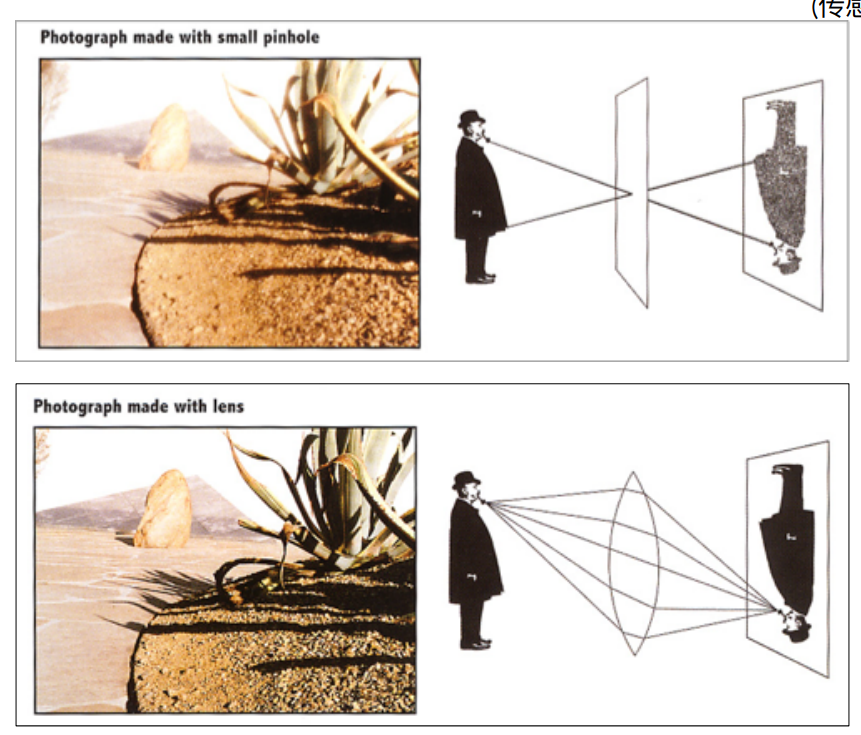
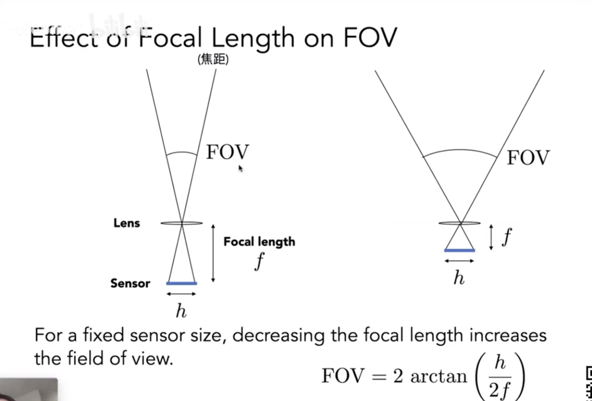
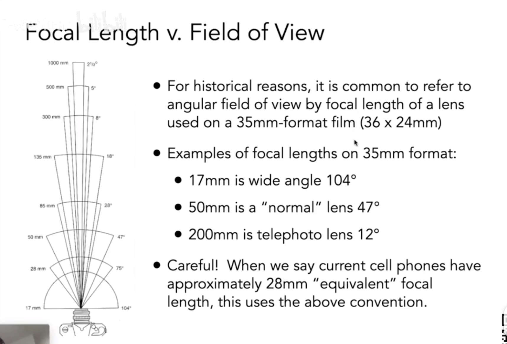
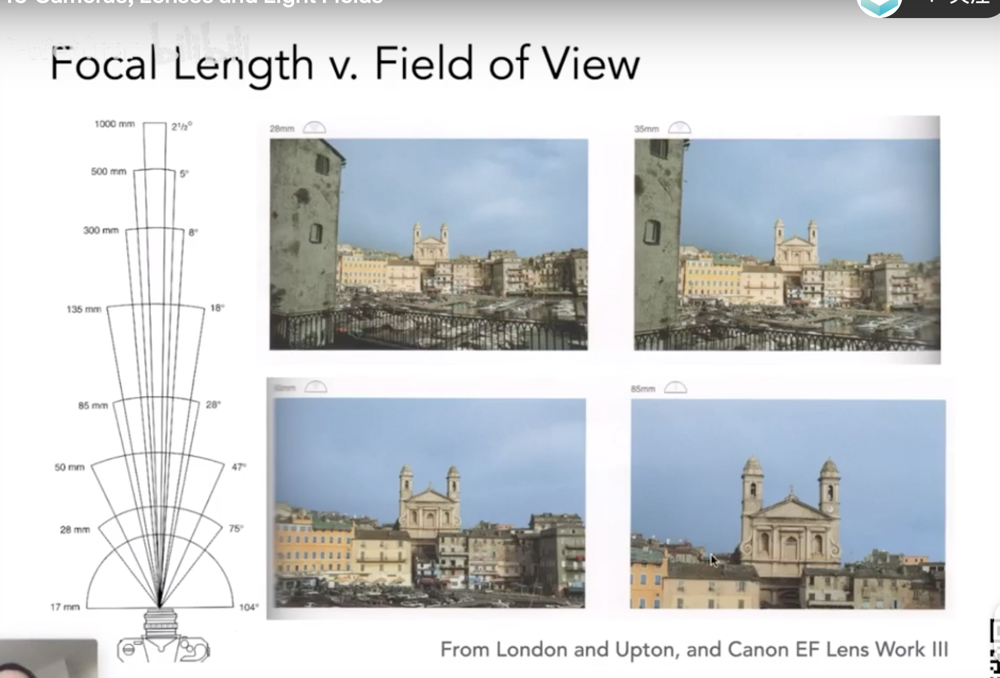
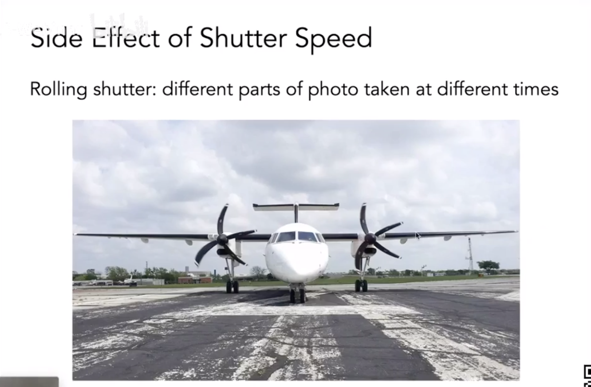
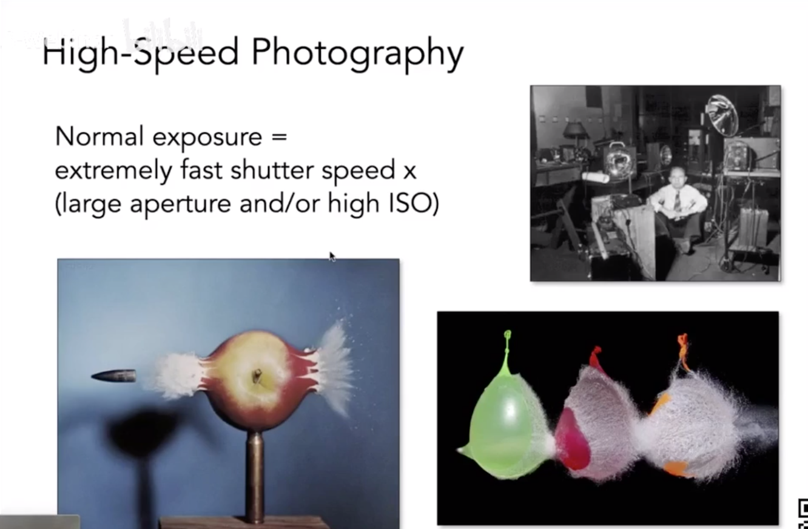
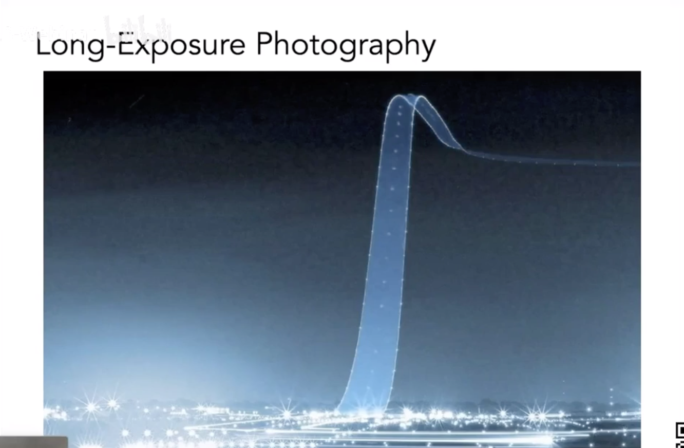

# 1.1 相機與透鏡
成像的背後都需要拍照，無論是光柵化還是光線追蹤，用合成的方法來生成光，最後使用一台相機來捕捉光

因此，成像 = 合成光 + 捕捉光
# 2.1 相機的組成
Pinholes & Lenses form image on Sensor (小孔成像)

- 快門控制光進入傳感器精確的曝光時間 Shutter Exposes Sensor For Precise Duration
- 快門可以控制光進入相機傳感器的時間
- 傳感器上每個點都會記錄來自各個方向的光的信息，所以傳感器記錄的是irradiance（輻照度，表示各種頻率輻射的總量)

## 2.2 針孔相機 Pinhole Camera
針孔相機成像是沒有**景深**的，我們做光線追踪的時候用的也是針孔相機，所以也是無法產生景深模糊的，如果我們能模擬光線與透鏡的作用，那麼我們也可以得到有景深的畫面

# 3.1 視場(FOV)
對於固定的傳感器尺寸，減小焦距會增加視野 For a fixed sensor size, decreasing the focal length increases the field of view

- 視場代表著攝像頭能夠觀察到的最大範圍，通常以角度來表示，視場越大， 觀測範圍越大。
- 視場FOV是在攝像機的前面的寬度h和聚焦距離f，可以推出FOV。

視場與傳感器大小和焦距都有關係，所以人們通常規定以 35mm 格式膠片 (36 x 24mm) 上使用的鏡頭焦距來表示視場角 For historical reasons, it is common to refer to angular field of view by focal length of a lens used on a 35mm-format film (36 x 24mm)

- FOV關係到傳感器和鏡頭到傳感器的距離有關。
- 改變聚焦，就改變了f，視場發生變化，拍攝同樣的畫面，獲得圖形的類型不同
- 相同的視場調整聚焦的距離。

# 3.1 曝光(Exposure)
曝光度是拍攝的時間和光照幅度，照光幅度大小關係到光圈和焦距
> H = T x E (Exposure = time x irradiance) 曝光時間由快門控制，irradiance由光圈與焦距決定
控制曝光的三要素：
- 光圈 Aperture size
- 快門 Shutter speed
- 感光度 ISO gain

## 3.2 光圈 Aperture size (F-Stop)

表格對應的光圈和快門速度可以得到幾乎等效的曝光（比如光圈f4.0到f8.0光圈直徑減小到1/2，面積變為原來的1/4，所以快門速度相應的要補償4倍） Example: these pairs of aperture and shutter speed give equivalent exposure

從4到8f的光圈，在其他不變的條件下，要是它畫面不變，那快門的時間從1/60增大到1/15。

F-Number (F-Stop):
- Written as FN or F/N. N is the f-number
- 在光學中，一個光學系統中的焦比（英語：f-number，或稱F值、F比例、相對孔徑、光圈值、光圈系数等，习惯上也简称「光圈」）表達鏡頭的焦距和光圈直徑大小的關係。

## 3.3 快門 Shutter speed
如果快門速度過慢，手持不穩或物體運動速度很快時容易產生運動模糊 Motion blur: handshake, subject movement

運動模糊是因為快門打開的時間內物體發生了運動，傳感器會把這個過程的光線都記錄下來，並且傳感器又有平均的效果，於是產生了運動模糊，也可以從反走樣的角度理解，只不過拍照是在時間上採樣 Tip: think about anti-aliasing

螺旋槳是因為快門關閉的時間不同，進來的光線在時間上差別，螺旋槳就被扭曲變形了。快門關乎到運動模糊的情況。

機械快門會產生果凍效應 Rolling shutter: different parts of photo taken at different times

## 3.4 感光度 ISO gain
感光度理解為在模數轉換前對信號進行的增益，相當於在對結果相乘 Multiply signal before analog-to-digital conversion
- 膠片：感光度會帶來顆粒 Film: trade sensitivity for grain
- 數碼：感光度會帶來噪點 Digital: trade sensitivity for noise
感光度是線性的（ISO 200需要ISO 100一半的光） Linear effect (ISO 200 needs half the light as ISO 100)

IOS關係到光圈的大小，它的光圈越大，它獲取到的光越多。如果在環境光比較暗的地方，拉到光圈的大小提高畫面的亮度，但它也同時帶來的很多的躁點，這個有點像光子在受光的面積上面光子的不足造成的。

在IOS基礎上，它乘上一個數，畫面亮度就發生改變。下面圖片展示不同亮度場景，IOS改變它們相同畫面亮度。

## 3.5 各種效果圖

# 4.1 透鏡

現在的相機基本都有很複雜的透鏡組 Real Lens Designs Are Highly Complex

現實中的的一些透鏡並不是我們假設的理想透鏡，它無法將光線會聚到一點 Real plano-convex lens (spherical surface shape). Lens does not converge rays to a point anywhere

在理想透鏡 (Ideal Thin Lens) 中，進入透鏡的所有平行光線都通過其焦點 All parallel rays entering a lens pass through its focal point

過一個焦點的所有光線在通過透鏡後將是平行的 All rays through a focal point will be in parallel after passing the lens

焦距可以任意改變（現實種用透鏡組也可以實現） Focal length can be arbitrarily changed (in reality, yes!).

- 這個是現實生活中的棱鏡，理想中的菱鏡是聚焦到一個點。
- 平行光在棱鏡折射，經過一點，可以改變棱鏡的焦點，也就是棱鏡動態改變。
- 光線過棱鏡的中心點是不會發生改變的，平行光過對面的焦點。
- 研究它物距和相距關係，相似三角形的做出相似比例。
- 通過兩個式子相同的項，化簡可以得到光圈和物距、相距之間的關係

# 5.1 景深
這裡不作過多介紹，不常見

# 提高內容
1. 景深推導

# 

