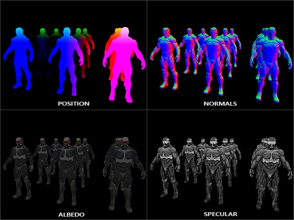
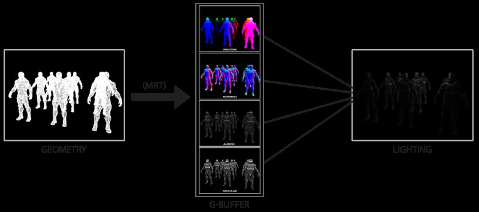
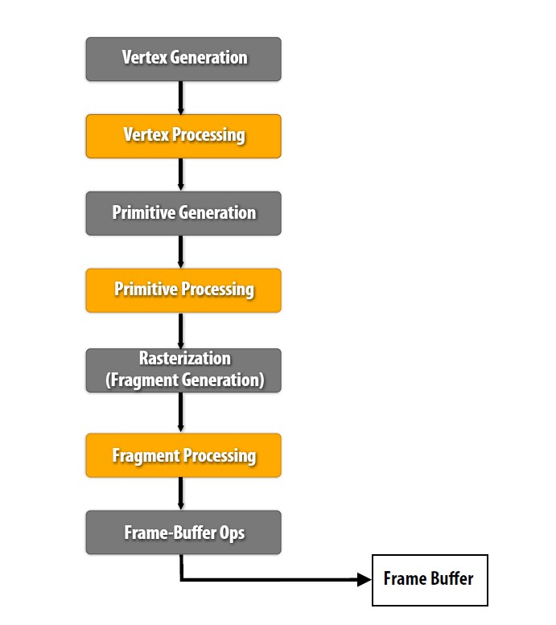

# 延遲渲染 Deferred Rendering
# 1.1 甚麼是延遲渲染？
>　A single rendering pass could generate a color image in one target, object identifiers in another, and world-space distances in a third. This ability has also given rise to a different type of rendering pipeline, called Deferred shading, where visibility and shading are done in separate passes

甚麼是延遲渲染？為什麼要延遲渲染？

假設一個場景中，有10000個Mesh需要渲染，有100個Light，
```c++
// 示例
int main()
{
    for (int i = 0; i < 10000;++i)
    {
        for (int j = 0; j < 100;++j)
        {
            RenderMesh(Mesh,Light)
        }
    }
}

void RenderMesh(int Mesh,int Light)
{
    for (int i = 0; i < Mesh * 3;++i)
    {
        RenderTriange(Light);
    }
}
```
在一個正常的場景，涉及的Mesh可能有上百萬個，如果此時我們還想要去渲染100個Light互相影響的結構，不就相當於把這幾百萬個Mesh再重新渲染100次？就算是RTX4090也hold不住

所以延遲渲染的做法就是先做深度測試(Depth Test)，再做渲染

# 2.1 延遲渲染的過程
## 2.1.1 Geometry Pass(幾何處理階段): 
- 正常的渲染過程，只是我們不做光照處理。做深度測試，我們把在屏幕中所看見的場景中各種幾何信息暫存起來，我們叫這個暫存的地方叫 G-buffer
- G-buffer放甚麼幾何信息?你可以放:
  - Position (像素位置)
  - Normals (光線)
  - Diffuse Albedo RGB (漫反射)
  - Spec-Power (高光反射)
  - Spec-Intersity
  - ...




## 2.1.2 Lighting Pass(光照處理階段):
- 在這個階段，我們只需要渲染一個屏幕大小圖像就可以了
- 在G-buffer中，我們已經存好了屏幕上的幾何信息，因此第一步就是獲取我們剛剛暫存信息
- 在此基礎上，再使用多渲染目標(Multiple Render Targets, MRT)技術，就可以完成所有的渲染目標
  - MRT: GPU硬件功能，它允許渲染管道一次將圖像渲染到多個渲染目標紋理



# 3.1 延遲渲染的偽代碼
方便理解其中的算法，這裡各種版本的延遲渣染算法的偽代碼
1. 通用版本的延遲著色算法偽代碼：
```
For each object:
Render to multiple targets
For each light:
Apply light as a 2D postprocess
```
2. 一個通用版本的deferred shading過程描述：
```
“Standard” deferred shading is a 2-stage process:

(1) draw (opaque) geometry storing its attributes (i.e. position as depth, normals, albedo color, specular color and other material properties) in a number of full screen buffers (typically 3 or 4)

(2) for each light source, draw its volume and accumulate lit surface color into final render target
```
3. 兩個Pass的延遲著色算法偽代碼：
```
Two-pass deferred shading algorithm
Pass 1: geometry pass
- Write visible geometry information to G-buffer
Pass 2: shading pass
For each G-buffer sample, compute shading
- Read G-buffer data for current sample
- Accumulate contribution of all lights
- Output final surface color
```
4. 多光源的延遲渲染的偽代碼：
```
Many-light deferred shading algorithm
For each light:
- Generate/bind shadow/environment maps
- Compute light’s contribution for each G-buffer sample:
For each G-buffer sample
- Load G-buffer data
- Evaluate light contribution (may be zero)
- Accumulate contribution into frame-buffer
```
可以將這裡的多光源計算過程理解為，對每個光源創建一個屏幕空間包圍矩形，然後用光照shader渲染這個矩形

# 4.1 延遲渲染 vs 正向渲染
這邊對正向渲染和延遲渲染的特性做一個對照列舉：

## 4.2 正向渲染
正向渲染（Forward Rendering），先執行著色計算，再執行深度測試。

正向渲染渲染n個物體在m個光源下的著色，複雜度為O(n*m)次。

Forward Rendering，光源數量對計算複雜度影響巨大，所以比較適合戶外這種光源較少的場景。

Forward Rendering的核心偽代碼可以表示為：
```
For each light:
	For each object affected by the light: 
		framebuffer += object * light
```
## 4.3 正向渲染渲染管線


## 4.4 延遲渲染
延遲渲染( Deferred Rendering)，先執行深度測試，再執行著色計算。

延遲渲染渲染n個物體在m個光源下的著色，複雜度為O(n+m)次。

Deferred Rendering 的最大的優勢就是將光源的數目和場景中物體的數目在復雜度層面上完全分開。也就是說場景中不管是一個三角形還是一百萬個三角形，最後的複雜度不會隨 光源數目變化而產生巨大變化。

Deferred Rendering的核心偽代碼可以表示如下，上文已經貼出過，這邊再次貼出，方便對比：
```
For each object: Render to multiple targets For each light: Apply light as a 2D postprocess
```
## 4.5 延遲渲染渲染管線


# 5.1 延遲渲染的優缺點分析
這裡列舉一下經典版本的延遲渲染的優缺點。

## 5.1.1延遲渲染的優點
Deferred Rendering 的最大的優勢就是將光源的數目和場景中物體的數目在復雜度層面上完全分開。也就是說場景中不管是一個三角形還是一百萬個三角形，最後的複雜度不會隨光源數目變化而產生巨大變化。
- 複雜度僅O(n+m)。
- 只渲染可見的像素，節省計算量。
- 用更少的shader。
- 對後處理(post-processing)支持良好。
- 在大量光源的場景優勢尤其明顯。

## 5.1.2 延遲渲染的缺點
- 內存開銷較大。
- 讀寫G-buffer的內存帶寬用量是性能瓶頸。
- 對透明物體的渲染存在問題。在這點上需要結合正向渲染進行渲染。
- 對多重採樣抗鋸齒（MultiSampling Anti-Aliasing, MSAA）的支持不友好，主要因為需要硬件開啟MRT。

> 就是一般來說實時渲染都會用到Diffuse/Specular或者Albeo/Roughnee/Metallic,以及其他數據（Normal，Depth），這樣會導致G-Buffer比較大，這也是為什麼到目前為止, 延遲渲染在手機平台都沒有成為主流的核心問題，同時也是VR不採用的主要問題，VR中要面對帶寬消耗x2的問題

# 6.1 延遲渲染的改進
針對延遲渲染上述提到的缺點，下面簡單列舉一些降低 Deferred Rendering 存取帶寬的改進方案。最簡單也是最容易想到的就是將存取的 G-Buffer 數據結構最小化，這也就衍生出了 Light Pre-Pass（即Deferred Lighting） 方法。另一種方式是將多個光照組成一組，然後一起處理，這種方法衍生了 Tile-Based Deferred Rendering。

也就是說，常見的兩種Deferred Rendering的改進是：

- 延遲光照 Light Pre-Pass（Deferred Lighting）
- 分塊延遲渲染 Tile-BasedDeferred Rendering

# 6.2 延遲光照 LightPre-Pass / Deferred Lighting
Light Pre-Pass即Deferred Lighting（延遲光照），旨在減少傳統Defferred Rendering使用G-buffer 時佔用的過多開銷（reduce G-buffer overhead）

延遲光照的主要渲染分成4個階段：
1. 幾何階段，渲染非透明物體，保存幾何信息；
2. 光照階段，保存光照信息；
3. Shading階段，再次渲染非透明物體，
4. 使用前向渲染半透明體。

相對於延遲渲染，延遲光照所需的buff信息更少更輕量，且第三步開始都是前向渲染，可以對每個不同的幾何體使用不同的 shader 進行渲染，所以每個物體的材質屬性將有更多變化，而且延遲光照通常情況下可以使用MSAA (除一些新特性外)。

延遲光照的具體思路：

1. 渲染場景中不透明（opaque ）的幾何體。將法線向量n和鏡面擴展因子（specular spread factor）m 寫入緩衝區。這個n/m-buffer 緩衝區是一個類似 G-Buffer的緩衝區，但包含的信息更少，更輕量，適合於單個輸出顏色緩衝區，因此不需要MRT支持。

2. 渲染光照。計算漫反射和鏡面著色方程，並將結果寫入不同的漫反射和鏡面反射累積緩衝區。這個過程可以在一個單獨的pass中完成（使用MRT），或者用兩個單獨的pass。環境光照明可以在這個階段使用一個 full-screen pass進行計算。

3. 對場景中的不透明幾何體進行第二次渲染。從紋理中讀取漫反射和鏡面反射值，對前面步驟中漫反射和鏡面反射累積緩衝區的值進行調製，並將最終結果寫入最終的顏色緩衝區。若在上一階段沒有處理環境光照明，則在此階段應用環境光照明。

Light Pre-Pass 的優點:
- 可以使用MSAA(多重採樣抗鋸齒)。由於使用了Z 值和 Normal 值，就可以很容易找到邊緣，並進行採樣
- 解決了渲染透明物體的問題
- 複雜度僅O(2n+m)。

# 7.1 分塊延遲渲染（Tile-Based Deferred Rendering）
分塊（tiled）渲染，目的是在計算光照前對光照進行裁剪，以提升場景中光源較多時的性能表現。分塊和分簇和其它延遲或者前向渲染技術能兼容得比較好，現在的商業和in house引擎也都在使用。

延遲渲染的瓶頸在於讀寫 G-buffer，在大量光源下，具體瓶頸將位於每個光源對 G-buffer的讀取及與顏色緩衝區（color buffer）混合。這裡的問題是，每個光源，即使它們的影響範圍在屏幕空間上有重疉，因為每個光源是在不同的繪製中進行，所以會重複讀取G-buffer中相同位置的數據，計算後以相加混合方式寫入顏色緩衝。光源越多，內存帶寬用量越大。

而分塊延遲渲染的主要思想則是把屏幕分拆成細小的柵格，例如每 32 × 32 像素作為一個分塊（tile）。

然後，計算每個分塊會受到哪些光源影響，把那些光源的索引儲存在分塊的光源列表裡。

最後，逐個分塊進行著色，對每像素讀取 G-buffer 和光源列表及相關的光源信息。

因此，G-buffer的數據只會被讀取1次且僅1次，寫入 color buffer也是1次且僅1次，大幅降低內存帶寬用量。不過，這種方法需要計算光源會影響哪些分塊，這個計算又稱為光源剔除（light culling），可以在 CPU 或 GPU（通常以 compute shader 實現）中進行。

用GPU計算的好處是，GPU 計算這類工作比 CPU 更快，也減少 CPU／GPU 數據傳輸。而且，可以計算每個分塊的深度範圍（depth range），作更有效的剔除。


# 8.1 實時渲染中常見的Rendering Path總結
實時渲染中常見的幾種 Rendering Path

目前已經提到的Rendering Path有：
- 正向渲染 （Forward Rendering）
- 延遲渲染 （Deferred Rendering）
- 延遲光照 （Light Pre-Pass / Deferred Lighting）
- 分塊延遲渲染（Tile-Based Deferred Rendering）

除此之外，還有如下一些後來提出的Rendering Path比較有趣：

- Forward+（即Tiled Forward Rendering，分塊正向渲染）
- 群組(分簇)渲染 Clustered Rendering

以虛幻為例，虛幻的管線是普通版本的tiled deferred和forward+

# 參考資料
- (虚幻引擎中的前向着色渲染器)[https://docs.unrealengine.com/5.0/zh-CN/forward-shading-renderer-in-unreal-engine/]
- (DX12渲染管线(3) - 分块/分簇延迟渲染])[https://zhuanlan.zhihu.com/p/66884611]
- (TBDRっぽい何かを実装してみた)[https://qiita.com/Onbashira/items/f5905c2fc227733edb78#%E9%95%B7%E6%89%80]
- (タイルベースポイントライトカリングでのタイルフラスタム計算メモ)[http://momose-d.cocolog-nifty.com/blog/2014/03/index.html]
- (【《Real-Time Rendering 3rd》 提炼总结】(七) 第七章续 · 延迟渲染(Deferred Rendering)的前生今世)[https://github.com/QianMo/Game-Programmer-Study-Notes/blob/master/Content/%E3%80%8AReal-Time%20Rendering%203rd%E3%80%8B%E8%AF%BB%E4%B9%A6%E7%AC%94%E8%AE%B0/Content/BlogPost07/README.md]

