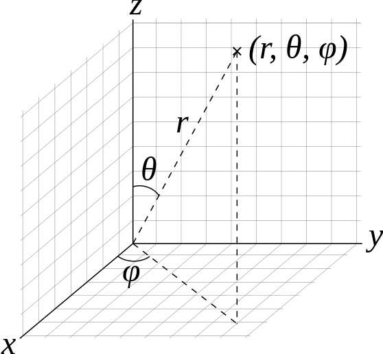

# 高級著色 BRDF 及相關技術

> Physically-Based Materials (Surface models) BRDF 基於物理的材質

> 想像你有一個不透明的桌面，一個激光發射器。你先讓激光向下垂直地射在那個桌面上，這樣你就可以在桌面上看到一個亮點，接著你從各個不同的方向來觀察那個亮點，你會發現亮點的亮度隨著觀察方向的不同而發生了改變。然後你站著不動，改變激光發射方向和桌面的夾角，你又會發現亮點的亮度發生了改變。這就是說，一個表面對不同的光線入射角和反射角的組合，擁有不同的反射率。 BRDF就是用來對這種反射性質進行定義的。 -- 大饼土博​

# 2. BRDF 前置-數學

# 2.1 球座標系 spherical coordinate system
[快速了解](https://zh.wikipedia.org/wiki/%E7%90%83%E5%BA%A7%E6%A8%99%E7%B3%BB)

球坐標標記為 ${(r,\ \theta ,\ \varphi )}$，其中:
- $r$ 代表徑向距離
- $\theta$ 代表極角，表示向量和Z軸的夾角
- $\varphi$ 代表方位角，表示向量在x-y平面上的投影和x軸的逆時針夾角。

# 2.2 立體角
平面中用弧度衡量角： $\theta=\frac{l}{r}$ ，所有弧長加起來是圓周長2πr，所以平面中周角為2π。

三維中拓展到立體角： $\Omega=\frac{A}{r^2}$ ，所有面積加起來是球表面積4πr^2，所以三維立體角之和為4π。

# 2.3 微分立體角
微分立體角（Differential Solid Angles）。從球面坐標角度看，可以用(θ，φ)定義球面上的方向，θ為該方向與z軸夾角，φ為該方向投影到xy平面後逆時針旋轉到y軸所需角度。那麼對於該方向上的面元dA，有： $dA=(rd\theta)(rsin\theta d\phi)=r^2sin\theta\ d\theta\ d\phi$ ，單位立體角 $d\omega=sin\theta\ d\theta\ d\phi$ （從而θ和φ不是對球面面積的均勻劃分）

# 3. BRDF 前置-輻射度量學 Basic Radiometry

物體發射的光流量+流入物體的光流量=直接流量+反射流量+吸收流量

光流量是單位時間通過單位面積的能量

光亮度是物體表面某方向單位投影區域單位立體角的光流量

沿著某條光線的光亮度是常數，但光通量隨距離增大而衰減（實際是二次衰減，但在計算機圖形學中採用線性衰減效果比較好）

光強度是單位立體角的輻射能量

輻射度(Radiosity)是單位面積流出的光通量

輻照度是單位面積流入的光通量

它們的關係：

光強度=光亮度*單位面積*入射角餘弦

輻照度(Irradiance) =光亮度*入射角餘弦*單位立體角

輻射度 =光亮度*入射角餘弦*單位立體角（但方向不同）

BRDF規定的是輻照度和光亮度的關係：

光亮度=BRDF*輻照度

如何描述光在空間中的屬性？ Radiant flux，intensity，inrradiance，radiance。在物理上可以準確定義光照。

那麼如果點光源均勻輻射能量，有 $\Phi=4\pi I$ 。

Irradiance：power per projected unit area，物體單位表面積（與光線垂直，所以要把光線分解，考察垂直表面的分量）接收到的能量：E(x)=dΦ(x)dA，單位為lm/m^2，lux。

法向n與光線入射方向l的夾角為θ，則E=ΦAcosθ

Radiance（luminance）：描述光線傳播過程中的能量，L(p,ω)=dΦ(p,ω)dωdAcosθ。

理解radiance和irradiance的關係。 Incident Radiance：入射，一個面元從某個立體角接收到的能量，理解為L(p,ω)=dE(p)dωcosθ，因此E(p)=∫H2Li(p,ω)cosθdω

如何描述光在空間中的屬性？ Radiant flux，intensity，inrradiance，radiance。在物理上可以準確定義光照。

# 3.1 輻射通量/光通量 Radiant Flux
Radiant Energy and Flux (Power)：Radient Energy用Q來表示，單位為焦耳；Radient flux (power)用φ表示，單位時間的能量。lm，流明，描述光通量的物理單位。描述的是在單位時間穿過截面的光能，或每單位時間的輻射能量，通常用Φ來表示，單位是W，瓦特。

那麼如果點光源均勻輻射能量，有 $\Phi=4\pi I$ 。

$$
\Phi=\frac{dQ}{dt}[W=Watt][lm=lumen]^*
$$

# 3.2 輻射強度/發光強度 Radiant Intensity
Radiant Intensity：power per solid angle，光源向四面八方輻射能量，每單位立體角的光通量，單位是流明/立體角，坎德拉（cd）。

概括一下：輻射強度(Radiant intensity，又譯作發光強度)，表示每單位立體角的輻射通量，通常用符號I表示，單位: 瓦特每球面度。

$$
I(\omega)=\frac{d\Phi}{d\omega}
$$

# 3.3 輻射率/光亮度 Radiance
Radiance（luminance）：描述光線傳播過程中的能量

輻射率（Radiance，又譯作光亮度，用符號L表示）,表示物體表面沿某一方向的明亮程度，它等於每單位投影面積和單位立體角上的輻射通量，單位是W·sr−1·m−2，瓦特每球面度每平方米。在光學中，光源的輻射率，是描述非點光源時光源單位面積強度的物理量，定義為在指定方向上的單位立體角和垂直此方向的單位面積上的輻射通量。光亮度L也可以理解為發光程度I在表面dA上的積分。

一種直觀的輻射率的理解方法是：將輻射率理解為物體表面的微面元所接收的來自於某方向光源的單位面積的光通量，因此截面選用垂直於該方向的截面，其面積按陰影面積技術計算。

輻射率的微分形式：

$$
L(p,\omega)=\frac{d\Phi (p,\omega)}{d\omega dAcos\theta}
$$

# 3.4 輻照度/輝度 Irradiance

# BRDF 定義

# BRDF 種類
1. Microfacet BRDF(微表面模型)
2. Disney Principled BRDF

# 其他的BRDF

