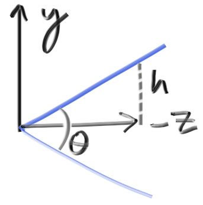
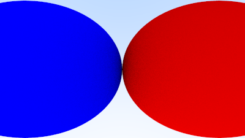
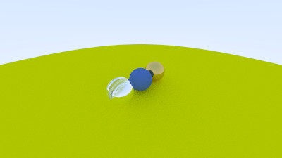

# 手寫軟光柵5
今天寫點折射率公式(斯涅爾定律):

$$
\eta \cdot \sin\theta = \eta' \cdot \sin\theta'
$$


我們要解 $\sin\theta'$ :

$$
\sin\theta' = \frac{\eta}{\eta'} \cdot \sin\theta
$$

我們假設反射面有一條反射光 $\mathbf{R'}$ 和法線 $\mathbf{n'}$ ，它們之間存在一個夾角 $\theta'$ ，我們可以把反射光 $\mathbf{R'}$ 分開成兩個部分: 垂直於法線 $\mathbf{n'}$ 和平行於法線 $\mathbf{n'}$ 的向量

$$
\mathbf{R'} = \mathbf{R'}_{\bot} + \mathbf{R'}_{\parallel}
$$

我們其實可以分別求解這兩個向量:

$$
\mathbf{R'}_{\bot} = \frac{\eta}{\eta'} (\mathbf{R} + \cos\theta \mathbf{n})
$$

$$
\mathbf{R'}_{\parallel} = -\sqrt{1 - |\mathbf{R'}_{\bot}|^2} \mathbf{n}
$$

你可以自己證明一下，其實使用 $\sin\theta = \frac{a}{b}$ 也可以夠用了。 (當然你發現了 $cos$ 也知道要用到別的公式 ^_^ )

那麼我們可以開始求解 $\cos\theta$ : 用向量相乘公式

$$
\mathbf{a} \cdot \mathbf{b} = |\mathbf{a}| |\mathbf{b}| \cos\theta
$$

我們假設 $|\mathbf{a}|$ 和 $|\mathbf{b}|$ 都是基向量 (都是1)

$$
\mathbf{a} \cdot \mathbf{b} = \cos\theta
$$

那麼我們就可以重寫 $\mathbf{R'}_{\bot}$ : 

$$
\frac{\eta}{\eta'} (\mathbf{R} + (\mathbf{-R} \cdot \mathbf{n}) \mathbf{n})
$$

好吧，那麼寫好公式以後就是寫代碼了:

```c++
// 函數中的 fmin 和 sqrt 函數分別用於確保餘弦值在 [0,1] 範圍內，併計算反射向量的水平分量的長度。
vec3 refract(const vec3& uv, const vec3& n, double etai_over_etat)
{
    // 函數首先使用點積計算出入射向量和法線向量之間的夾角的餘弦值
	auto cos_theta = fmin(dot(-uv, n), 1.0f);
	vec3 r_out_prep = etai_over_etat * (uv + cos_theta * n);
	vec3 r_out_parallel = -sqrt(fabs(1.0 - r_out_parallel.length_squared())) * n;
	return r_out_prep + r_out_parallel;
}
```

```c++
// 電介質?
class dielectric : public material
{
public:
    dielectric(double index_of_reflection) : ir(index_of_reflection) {}
    virtual bool scatter(
        const ray& r_in, const hit_record& rec, color& attenuation, ray& scattered
    ) const override
    {
        attenuation = color(1.0, 1.0, 1.0);
        double refraction_ratio = rec.front_face ? (1.0 / ir) : ir;
        
        vec3 unit_direction = unit_vector(r_in.direction());
        vec3 refracted = refract(unit_direction, rec.normal, refraction_ratio);
        scattered = ray(rec.p, refracted);

        return true;
    }
public:
    double ir; // Index of Refraction
};
```

```c++
// [main.cpp] Changing left and center spheres to glass
auto material_ground = make_shared<lambertian>(color(0.8, 0.8, 0.0));
// 我們假設材質的折射率為1.5
auto material_center = make_shared<dielectric>(1.5);
auto material_left   = make_shared<dielectric>(1.5);
auto material_right  = make_shared<metal>(color(0.8, 0.6, 0.2), 1.0);
```

# Total Internal Reflection 全內反射

如果按照這個公式來說會有一個問題，就是當面對擁有更高的折射率(超過1.0)的材質時候，這個反射的效果就會看起來怪怪的。以下是原公式的推導:

$$
\sin\theta' = \frac{\eta}{\eta'} \cdot \sin\theta
$$

我們假設裡外的折射率分別是: $\eta = 1.5$ 和 $\eta' = 1.0$

$$
\sin\theta' = \frac{1.5}{1.0} \cdot \sin\theta
$$

$$
\frac{1.5}{1.0} \cdot \sin\theta > 1.0
$$

$\sin\theta'$ 超過了1.0，而實際上我們希望這個值能夠維持在1.之內

因此當值超過了1，玻璃球無法反射任何東西，我們可以對於超過1.0的特殊情況做處理:

```c++
// [material.h] Determining if the ray can refract
if (refraction_ratio * sin_theta > 1.0) {
    // Must Reflect
    ...
} else {
    // Can Refract
    ...
}
```

這裡所有的光都被反射了，因為在實際情況中通常發生在固體物體內部，所以它被稱為 __“Total Internal Reflection 全內反射”__ 。這就是為什麼有時當你在水中被淹沒的時候，水與空氣邊界就像是一塊完美的鏡子

我們可以用 $\sin\theta$ 和 $\cos\theta$ 求解: 

$$
\sin\theta  = \sqrt{1 - \cos^2\theta}
$$

$$
\cos\theta = \mathbf{R} \cdot \mathbf{n}
$$


```c++
// 電介質
class dielectric : public material
{
public:
    dielectric(double index_of_reflection) : ir(index_of_reflection) {}
    virtual bool scatter(
        const ray& r_in, const hit_record& rec, color& attenuation, ray& scattered
    ) const override
    {
        attenuation = color(1.0, 1.0, 1.0);
        double refraction_ratio = rec.front_face ? (1.0 / ir) : ir;
        
        vec3 unit_direction = unit_vector(r_in.direction());
        
        // 更新後的版本，如果超過1.0則使用reflect()
        double cos_theta = fmin(dot(-unit_direction, rec.normal), 1.0);
        double sin_theta = sqrt(1.0 - cos_theta * cos_theta);

        bool cannot_refract = refraction_ratio * sin_theta > 1.0;
        vec3 direction;

        if (cannot_refract)
            direction = reflect(unit_direction, rec.normal);
        else
            direction = refract(unit_direction, rec.normal, refraction_ratio);

        scattered = ray(rec.p, direction);
        //

        return true;
    }
public:
    double ir; // Index of Refraction
};
```

# Schlick Approximation 菲涅爾近似
菲涅爾近似，聽說有很多人都會使用這個公式去模擬玻璃球:

[Schlick's approximation](ttps://en.wikipedia.org/wiki/Schlick's_approximation)

$$
R(\theta) = R_0 + (1 - R_0)(1 - \cos \theta)^5
$$

$$
R_0 = \left(\frac{n_1-n_2}{n_1+n_2}\right)^2
$$

代碼如下:

```c++
// Full glass material
class dielectric : public material
{
public:
    dielectric(double index_of_reflection) : ir(index_of_reflection) {}
    virtual bool scatter(
        const ray& r_in, const hit_record& rec, color& attenuation, ray& scattered
    ) const override
    {
        attenuation = color(1.0, 1.0, 1.0);
        double refraction_ratio = rec.front_face ? (1.0 / ir) : ir;
        
        vec3 unit_direction = unit_vector(r_in.direction());
        
        // 更新後的版本，如果超過1.0則使用reflect()
        double cos_theta = fmin(dot(-unit_direction, rec.normal), 1.0);
        double sin_theta = sqrt(1.0 - cos_theta * cos_theta);

        bool cannot_refract = refraction_ratio * sin_theta > 1.0;
        vec3 direction;

        if (cannot_refract || reflectance(cos_theta, refraction_ratio) > random_double())
            direction = reflect(unit_direction, rec.normal);
        else
            direction = refract(unit_direction, rec.normal, refraction_ratio);

        scattered = ray(rec.p, direction);
        //

        return true;
    }
public:
    double ir; // Index of Refraction
private:
    static double reflectance(double cosine, double ref_idx)
    {
        // Use Schlick' approximation
        auto r0 = (1 - ref_idx) / (1 + ref_idx);
        r0 = r0 * r0;
        return r0 + (1 + r0) * pow((1 - cosine), 5);
    }

};
```


相機很難調試。所以總是循序漸進地開發軟光珊。

首先，讓我們允許一個可調整的視野 (fov)。

這是您通過門戶看到的角度。由於我們的圖像不是正方形，因此 fov 在水平方向和垂直方向上是不同的。

我總是使用垂直視野。我通常也以度數為單位指定它，並在構造函數中更改為弧度制。



重新寫一下相機類: $h = \tan(\frac{\theta}{2})$
```c++
// [camera.h] Camera with adjustable field-of-view (fov)
class camera
{
public:
	camera(
		double vfov,
		double aspect_ratio
	)
	{
		auto theta = degrees_to_radians(vfov);
		auto h = tan(theta / 2);
		auto viewport_height = 2.0 * h;
		auto viewport_width = aspect_ratio * viewport_height;

		auto focal_length = 1.0;

		origin = point3(0, 0, 0);
		horizontal = vec3(viewport_width, 0, 0);
		vertical = vec3(0, viewport_height, 0);
		lower_left_corner = origin - horizontal / 2 - vertical / 2 - vec3(0, 0, focal_length);
	}
	ray get_ray(double u, double v) const
	{
		return ray(origin, lower_left_corner + u * horizontal + v * vertical - origin);
	}
private:
	point3 origin;
	point3 lower_left_corner;
	vec3 horizontal;
	vec3 vertical;
};

```




為了可以任意的地點觀察，我們將放置相機的位置稱為 __lookfrom__，以及我們注視的點 __lookat__。（稍後，如果需要，您可以定義一個觀察方向而不是一個觀察點。）

我們還需要一種方法來指定相機的滾動或側向傾斜：圍繞 __lookat-lookfrom__ 軸的旋轉。

另一種思考方式是，即使您保持 lookfrom 和 lookat 不變，您仍然可以圍繞鼻子旋轉頭部。我們需要的是一種為相機指定“向上”向量的方法。此向上向量應位於與視圖方向正交的平面內。


我們實際上可以使用我們想要的任何向上向量，並將它簡單地投影到這個平面上以獲得相機的向上向量。我使用命名“向上查看”(vup) 向量的通用約定。幾個叉積，我們現在有一個完整的正交基礎 $(u,v,w)$ 來描述我們相機的方向。

請記住 vup、v 和 w 都在同一平面上。請注意，就像之前我們的固定相機面向 -Z 一樣，我們的任意視圖相機面向 -w。請記住，我們可以——但我們不必——使用 world up $(0,1,0)$ 指定 vup。這很方便，並且自然會保持您的相機水平，除非你想要嘗試的不一樣的相機角度。

```c++
// [camera.h] Positionable and orientable camera
class camera
{
public:
	camera(
		point3 lookfrom,
		point3 lookat,
		vec3 vup,
		double vfov,
		double aspect_ratio
	)
	{
		auto theta = degrees_to_radians(vfov);
		auto h = tan(theta / 2);
		auto viewport_height = 2.0 * h;
		auto viewport_width = aspect_ratio * viewport_height;

		auto w = unit_vector(lookfrom - lookat);
		auto u = unit_vector(cross(vup, w));
		auto v = cross(w, u);

		auto focal_length = 1.0;

		origin = lookfrom;
		horizontal = viewport_width * u;
		vertical = viewport_height * v;
		lower_left_corner = origin - horizontal / 2 - vertical / 2 - w;
	}
	ray get_ray(double s, double t) const
	{
		return ray(origin, lower_left_corner + s * horizontal + t * vertical - origin);
	}
private:
	point3 origin;
	point3 lower_left_corner;
	vec3 horizontal;
	vec3 vertical;
};

```

