# Vue.js

prerequisite: html,css,js

start here: https://www.bilibili.com/video/BV1Zy4y1K7SH

why vue? traditional:


## 002 Vue簡介

一套用於構建用戶界面的*漸進式*JavaScript框架(可以不停加庫)

1. 采用**組件化**模式，提高代碼複用率，且更好維護

2. **聲明式**編碼，無需直接操作DOM，提高開發效率

3. 使用**虛擬DOM**+優秀的**Diff算法**，盡量複用DOM節點

   

## 003 Vue官網使用指南


Vue官網 https://cn.vuejs.org

**很多有用的庫 https://github.com/vuejs/awesome-vue**

## 004 搭建Vue開發環境

可CDN，可NPM

CDN: ` <script type="text/javascript" src="../js/vue.js"></script>`

Product mode: vue.min.js (沒有error詳細提示)

Develop mode: vue.js (推薦開發時使用)

Google chrome extension: **vue-devtools**


## 005 006 Hello小案例


可使用Live Server測試

### 插值


- 在html內DOM id為root的插值 `{{name}}` 會顯示`尚硅谷`
- 插值內可為js表達式(表達式會產生一個值)，如 `date.now()`會顯示當前日期，`x===y ? 'a':'b' `會產生a或b，但不能是語句如if, for
- 一個Vue對應一個DOM，一對一關係
### 總結


## 007 模板語法 008 數據綁定

### v-bind:

在標籤<>如`<a href:"url">`內不能用插值`{{url}}`，要用`v-bind`簡寫為`:`

例如`<a :href="url">`

`v-bind:`是**單向數據綁定**

### v-model:

`v-model:`是**雙向數據綁定**，但只能在用戶**輸入類元素**上(當有attribute有value值的)

`<input type=text v-model:value="name">`可簡寫為`<input type=text v-model="name">`

## 009 el與data的兩種寫法

- 創建Vue的快捷方式: 在vscode打`v1`

- 取代el: `v.$mount(#root)`，好處是可以使用function執行mount的**條件**，如`setTimeout(()=>{v.$mount('#root')},1000);`


- 將data寫成一個必須**return**值的function (component必用寫法)


- 由vue管理的functions不能寫anonymous function`()=>{}`，否則**this**會從vue實例變成window

## 010 理解MVVM

### 總結


# 011 回顧Object.defineProperty方法

```html
<script>
    let person = {
        name:'Kelvin',
        sex:'M'
    }
    Object.defineProperty(person,'age',{
        value:18,
        enumerable:true,
        writable:true,
    })
</script>
```

defineProperty功能是增加person裡的key age值為18

enumerable:true的意思是可以**被枚舉**(v-for時會被enum出來，默認不會)

writable:true的意思是可以**被修改**(默認不能)


configurable:false的意思是可以**不能被刪除**(默認可以)

### **Getter, Setter**

***需求：變更number值同時變更person.age, 變更person.age值同時變更number***

```html
<script>
    let number = 21
    let person = {
        name:'Kelvin',
        sex:'M'
    }
    Object.defineProperty(person,'age',{
        get(){
            console.log('有人讀取age屬性了')
            return number
        }
        set(value){
        	console.log('有人修改了age屬性，且值是',value)
        	number = value
    	}
    })
</script>
```

利用**get()**可以在**每次修改number的值**時invoke getter即能顯示更新

利用**set()**可以在**每次修改person.age的值**時invoke setter同時修改**number**

## 012 理解數據代理

通過一個對象對另一個對象中屬性的操作（讀／寫）

```html
<script type="text/javascript">
	let obj = {x:100}
	let obj2 = {y:200}
	
	Object.defineProperty(obj2,'x',{
		get(){
			return obj.x
		},
		set(value){
			obj.x = value
		}
	})
</script>
```

在console中可見到obj2的x值和get x和set x


## 013 Vue中的數據代理

   

**數據代理**目的是不用打`{{_data.name}}`而是`{{name}}`就可以

## 014 Vue事件處理

### v-on:
```html
<div id="root">
	<button v-on:click="showInfo">Click me to show info</button>
    // @ 是v-on:的縮寫
	<!-- <button @click="showInfo">Click me to show info</button> -->
</div>
```

### methods:{}

```javascript
const vm = new Vue({
	el:"#root",
	methods:{
		showInfo(){
			alert('I am info')
		}
	}
})
```

### event.target 會顯示被按按鈕的html

```javascript
methods:{
	showEvent(event){
		console.log(event.target)
	}
}
```

### 傳參數同時傳$event

`<button @click="showInfo($event, 66)">Send 66 and event info</button>`

`showInfo(event,number)`

### 總結


## 015 事件修飾符

`@click.prevent` 阻止默認事件（如a href跳轉）

`@click.stop` 阻止母層觸發子層事件（<div @click="mother"><button @click.stop="son">&lt;/button>&lt;/div>）

`@click.once` 事件只觸發一次

`@click.capture` 事件在捕獲階段處理（母層直接先觸發）

`@wheel.passive` 事件的默認行為立即執行，無需等待事件回調執行完畢

## 016 鍵盤事件

`@keydown @keyup`

可以使用keycode判定按下的按鈕 （13是enter） 

`@keyup.enter .delete (both Backspace and delete) .esc .space .up .down .left .right` 

`@keydown.tab` keyup無用

`@keyup.ctrl .alt .shift .meta` 須同時配合其他鍵使用

`@keydown.ctrl .alt .shift .meta` 可單獨使用

`@keydown.13` 不推薦因各電腦keycode可能不一樣

## 017 事件總結

`.prevent.stop @keyup.ctrl.y`修飾符可連著用

## 018 019 計算屬性 020 計算屬性簡寫

只要data中的值發生變化，vue便會重新渲染頁面

vue裏面寫的會成*property*（屬性）和*method*

vue當中會用`computed`來包裹要經運算得出的data

```javascript
computed:{
	fullName:{
		//有人讀取fullname時invoke getter
		get(){
			return this.firstName + '-' + this.lastName
		}
	}
}
```

在console中可調出vm.\_data.firstname跟vm.\_data.firstname，但fullname不能，因其不在data內，但會在vue實例內（vue.fullname，可用插值{{fullname}}直接顯示）

### 總結


#### 簡寫

```javascript
computed:{
	fullName(){
		return this.firstName + '-' + this.lastName
	}
}
```

如果data中有value改變值但沒有在模板中用到，vuetools中的不會顯示，但值的確已更改。

## 022 監視屬性 023 深度監視  024 簡寫

### watch:{}

當屬性發生改變時觸發`handler()`，`newValue`跟`oldValue`分別為修改後和修改前的參數。

`immediate:true`的意思是初始化時會觸發一次`handler()`

```javascript
watch:{
	isHot:{
		immediate:true,
		handler(newValue,oldValue){
			console.log('isHot被修改了',newValue,oldValue)
		}
	}
}
```

也可以在Vue實例後使用 `vm.$watch()`監視。

### 深度監視

`'numbers.a':{handler(){}}` 監視多級結構

```javascript
watch:{
	numbers:{
		deep:true;
		handler(){
			console.log('內部有值改變了')
		}
	}
}
```

`deep:true` 監視多級結構而不用numbers.a

### 簡寫

***前提是只使用handler***

```
watch:{
	isHot(newValue,oldValue){
		console.log(newValue,oldValue)
	}
}
```

### 所有vue管理的函數都不要用匿名函數

## 025 Watch 與Computed的分別

computed的原理是return值

watch的原理是可執行函數，可以寫**異步函數**

### 重要總結


普通函數：xxx(){}	箭頭函數：()=>{}	**釐清兩者的原因是要將成功this指向vm**

## 026 綁定class樣式(style)

案例：一個div的style為basic normal，點擊後變成了basic happy

```html
<body>
	<div id="root">
		<div class="basic" :class="mood" @click="changeMood"></div>
	</div>
</body>
<script type="text/javascript">
	const vm = new Vue({
		el:'#root',
		data:{
			mood:'normal'
		},
        methods:{
        	changeMood(){
    			this.mood = 'happy'
    		}
    	}
	})
</script>
```

也可以用`arr`儲存多個參數，來一次套用多個樣式。(`arr=[rectangle, rounded, red]`)

也可以用`obj`控制多個參數，來選擇套用哪個樣式。(`obj:{rectangle:true, rounded:false, red:true}`)

## 027 綁定style樣式

```html
<body>
	<div id="root">
		<div :style="styleObj"></div>
	</div>
</body>
<script type="text/javascript">
	const vm = new Vue({
		el:'#root',
		data:{
			styleObj: {
                fontSize: '40px',
                color: 'red',
                backgroundColor:'orange'
            }
		}
	})
</script>
```

要留意的是styleObj內會用**駝峰寫法**

## 028 條件渲染

`v-show`  調整display屬性但結構還在，可以寫js表達式

`v-if ` 為false時結構會不見

也有 `v-else-if`和`v-else`但**必須跟著v-if同層連接著用！**

**遇到多重複用一樣`v-if` (v-show不能) 的可以用`<template></template>`包住，不會在渲染時影響結構因它不會被渲染

## 029 列表渲染

### v-for

```html
<ui>
	<li v-for = "p in persons" :key="p.id">
		{{p.name}}-{{p.age}}
	</li>
</ui>
...
data:{
	persons:[
		{id:'001',name:'Amy',age:10},
		{id:'002',name:'Bob',age:11},
		{id:'003',name:'Cat',age:10}
	]
}
```

### (p,index) in persons 寫法

```html
<ui>
	<li v-for = "(p,index) in persons" :key="index">
		{{index}}.{{p.name}}-{{p.age}}
	</li>
</ui>
...
data:{
	persons:[
		{id:'001',name:'Amy',age:10},
		{id:'002',name:'Bob',age:11},
		{id:'003',name:'Cat',age:10}
	]
}
```

### 遍歷對象

```html
<ui>
	<li v-for = "(value, key) of car" :key="key">
		{{key}}:{{value}}
	</li>
</ui>
...
data:{
	car:{
		name:'Audi'
		price:'700k'
		color:'black'
	}
}
```

也可以遍歷字符串，及數字 (`v-for="(number,index) of 5" :key="index"`)

## 030 Key作用與原理


## 031 列表過濾

***案例：模糊搜索***


`immdeate:true`作用為先執行一次**空字符串**的檢索，因filPersons[]為空，需要執行一次indexOf('')將所有匹配項放進filePersons[]，而**所有persons.name都擁有空字符串**

### Computed 的快捷寫法

```javascript
computed:{
	filPersons(){
		return this.persons.filter((p)=>{
			return p.name.indexOf(this.keyWord) !== -1
		})
	}
}
```

*每次更新keyword時都會更新filPersons[]

## 032 列表排序

### 復習 arr.sort(), 利用Computed

***案例：模糊搜索+排序***


## 033 034 Vue監視data值改變原理

Vue監視data值改變**失敗**案例: `this.persons[0] = {id:'001', name:'Mr. Ma', age:'50', sex:'M'}`


雖然值已經改變，但這種寫法Vue不會將新的數據渲染，反而上面的寫法**奏效**

### 原理：查看_data


Vue會加工data裡的address和name配置一個`reactiveSetter`跟`reactiveGetter`，主要原理是利用**Observer()**

## 035 Vue.set() 

假如對象內的值為空(student.age)，{{student.age}}不會報錯，其為{{undefined}}

手動在console在data加值，vue不會偵測到，可以用`Vue.set()`

Vue.set(`target`,`key`,`val`), Example: 

1. 可以在student加property`Vue.set(vm.student,'sex','男')` 
2. 可以在student改第1個property值`Vue.set(vm.student,0,'Amy')`
3. 不能直接在Vue增加`Vue.set(vm._data,'teacher','一個老師')`

Vue._data.student === Vue.student **True**

## 036 Vue監視數組改變原理


vue 無法偵測到到這種寫法的改變，因沒有為index服務的setter, getter

Vue是**可以偵測到影響數組改變的function**的:

​	`push, pop, shift, unshift, splice, sort, reverse`(filter不能因為沒有影響原數組)


Vue寫的push並非原來的push (Array.prototype.push)，Vue包裝了原有的push function再額外加了Vue自己的東西: **重新渲染模板**

## 037 總結Vue監視data改變


Vue.set也可以寫成`this.$set()`

加朋友及改朋友名字:


**可以修改friends[0].name，因為有getter, setter**


加愛好及改愛好


updateHobby() 有兩種寫法

### 總結


即 `this.arr = this.arr.filter((h)=>{return h!=='抽煙'}`

## 038 收集表單數據

**案例:**


```html
<form @submit.prevent:'submit'>
    <!-- 不用action因為我們用vue的@submit-->
    <!-- prevent是為了防止默認動作:提交表單，因為我們想用methods:submit搞-->
    帳號:<input type="text" v-model="userInfo.account"><br/>
    密碼:<input type="password" v-model="userInfo.password"><br/>
    <!--年齡可以用type="number" 及v-model.number控制取值為數值-->
    年齡:<input type="number" v-model.number="age">
    性别: 
    男<input type="radio" name="sex" v-model="userInfo.sex" value="male">
    女<input type="radio" name="sex" v-model="userInfo.sex" value="female">
    愛好:
    學習<input type="checkbox" v-model="userInfo.hobby" value="study1">
    讀書<input type="checkbox" v-model="userInfo.hobby" value="study2">
    温習<input type="checkbox" v-model="userInfo.hobby" value="study3">
    所屬書院:
    <select v-model="userInfo.RC">
        <option value="">請選擇書院</option>
        <option value="cklc">CKLC</option>
        <option value="mlc">MLC</option>
        <option value="spc">SPC</option>
    </select><br/>
    其他信息:
    <textarea v-model.lazy="userInfo.other">
    </textarea><br/>
    <input type="checkbox" v-model:'userInfo.agree'>
    閱讀並接受用戶協議<a href=""></a><br/>
    <!-- 在form內的button會為默認提交表單 -->
    <button>提交</button>
</form>

<script type="text/javascript">
const vm = vue(){
	data:{
        //更好的做法是用一個大object包住
        userInfo:{
            acount:'',
			password:'',
			sex:'male',
			hobby:[],
			RC:'',
			agree:''
        }
	}
	methods:{
		submit(){
            console.log(JSON.stringify(this.userInfo))
        }
	}
}
</script>
```

checkbox不配置value，vue會解釋為boolean, checked: true or false，可應用在*閱讀並接受用戶協議*

### 著重點

`@submit.prevent`

**v-model修飾符** ***.number .trim .lazy***


## 039 過濾器

### 第三方庫網站: bootcdn.cn

### filters:{}

`{{time | timeFormater}}` 也可以傳參 `{{time | timeFormater('自訂格式')}}` 也可以串聯使用 `{{time | timeFormater('自訂格式') | mySplice}}`


### 全局過濾器


### 總結


## 040 v-text 指令


## 041 v-html 指令

先講安全性問題

可以利用**cookies editor** (google chrome extension) 來access cookies，來拿取session

### v-html問題 XSS攻擊


可以發送cookies到其他網


而加上HttpOnly的不會被document.cookie調出

## 042 v-cloak

JS阻塞兩情況: 

1. CDN引入放在head，vue未渲染好，不會顯示頁面
2. CDN引入放在body尾部，會先渲染頁面上的{{name}}，vue.js加載好後才會顯示名字的值

v-cloak可以解決這個問題


## 043 v-once


## 044 v-pre


## 045 046 047 自定義指令

`directives:{}`

### 以自定義**v-big-number**來示範

```html
<span v-big="n"></span>
<script type="text/javascript">
new Vue({
	el:'#root',
	data:{
		n:1
	},
	directives:{
        //big-number函數命名注意不能有大階
		'big-number'(element,binding){
			console.log(element,binding)
            element.innerText = binding.value * 10
		}
	}
})
</script>
```

首先先可以去看一下element跟binding是甚麼


element是真實DOM (可以以`console.dir(a)`或`console.log(a instanceof HTMLElement)`為True方法驗證), 而展開b可以看到


expression為`n`，value為n的值`1`

`element.innerText = binding.value * 10` 操作DOM的文字成為expression中的值乘10

### 以自定義**v-fbind**來示範, v-fbind功能為自動獲取焦點到輸入框

不能用function式寫，要用**對象**式方法寫

```html
<input type="text" v-fbind="n">
<script type="text/javascript">
new Vue({
	el:'#root',
	directives:{
		fbind:{//以下的this指定的都是window
            //指令與元素成功綁定時執行
			bind(element,binding){
                element.value = binding.value
            },
            //指令所在元素被插入頁面時執行
            inserted(element,binding){
                element.focus()
            },
            //指令所在的模板被重新解析時執行
            update(element,binding){
                element.value = binding.value
                element.focus()
            }
		}
	}
})
</script>
```

`Vue.directive()`可以在vue instance外寫自定義指令，而其為**global**的

### 總結


## 048 引出生命周期

案例：頁面一開始便會出現一個循環變化opacity的h2

```html
<body>
    <div>
        <!--
style="opacity=1"為html寫法，vue寫法會用v-bind(:即v-bind)內可寫js表達式，而style為需要一個key:value物件，即寫成{opacity:opacity}，因opacity同名所以在ES6可簡寫成{opacity}
		-->
		<h2 :style="{opacity}">我會不停變透明度</h2>
	</div>
</body>
<script type="text/javascript">
    const vm = new Vue({
        el:'#root',
        data:{
            opacity:1
        }
    })
    //不推薦定時器寫在vue實例外，要用vm.opacity以讀取opacity值，以及這並非全局之用
    setInterval(() => {
        //在vue的世界中減0.01未必真的減0.01
        vm.opacity -= 0.01
        if(vm.opacity <= 0) vm.opacity = 1
    }, 16)
</scripts>
```

### 在vue methods:{}內的寫法(不推薦)

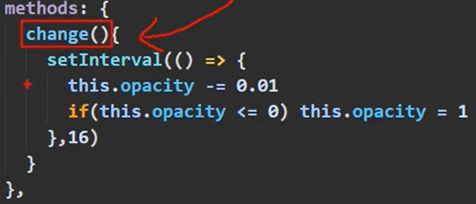

思考點：在哪裡調用`change()`? 使用methods會出現找不到調用的地方

### 用mounted(){}

Vue完成模板的解析並把*初始的*真實的DOM元素放入頁面後(即掛載完畢)調用**mounted**

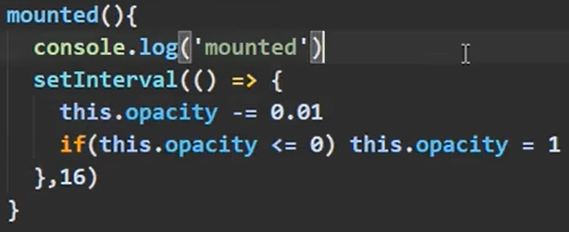

**此處的this是vue喔

### 總結


## 049 生命周期 掛載流程

可利用`debugger;`製作斷點卡頓

`Vue template option`: 容器內可為空，**綠色框內容會整個代替紅色框內容**，但template內**只能一個根元素**(用div包著)，ES6可用`` 包著換行字串

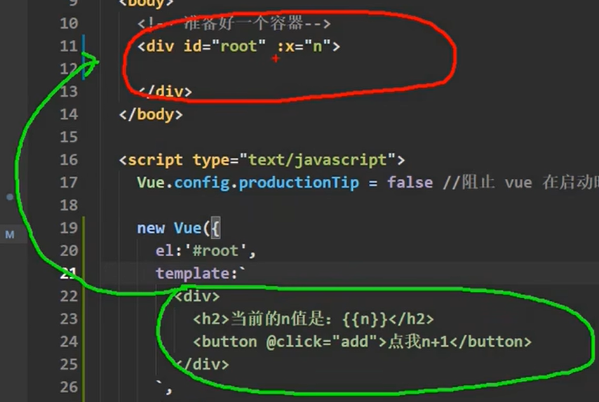

### 掛載流程圖 - beforeCreate, created, beforeMount, mounted

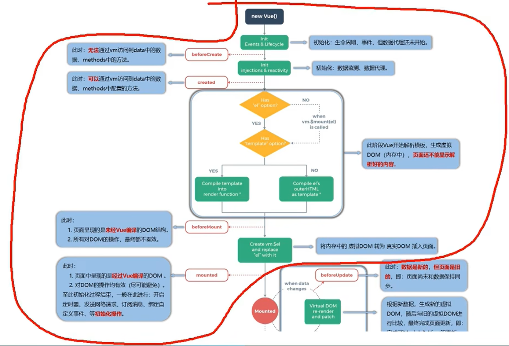

## 050 生命周期 更新流程

### 更新流程圖 - beforeUpdate, updated

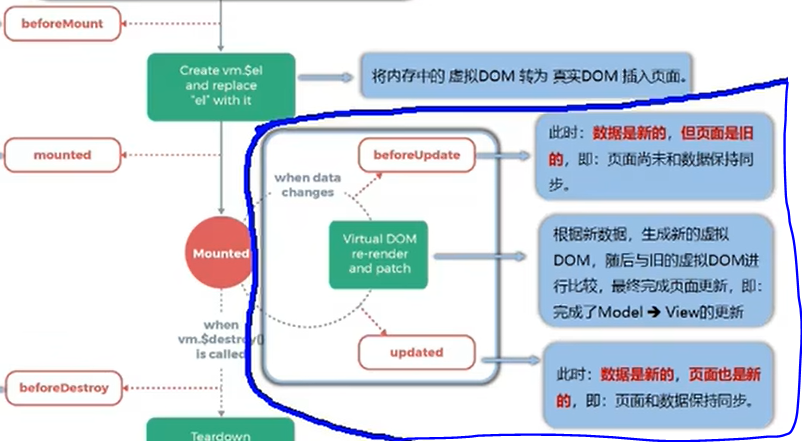

## 051 生命周期 銷毀流程

### vm.$destroy() [vm的自我終結，少用]

vm的工作成果會**保留在頁面**，只是銷毀了vm實例，vue不再管理你的模板


### 銷毀流程圖 - beforeDestroy, destroyed

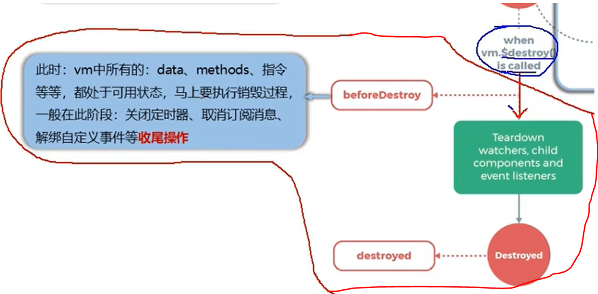

在beforeDestroy `this.n = 99` 或`add()`可用但不會再走**更新流程**

## 052 生命周期 總結


## 053 對組件的理解

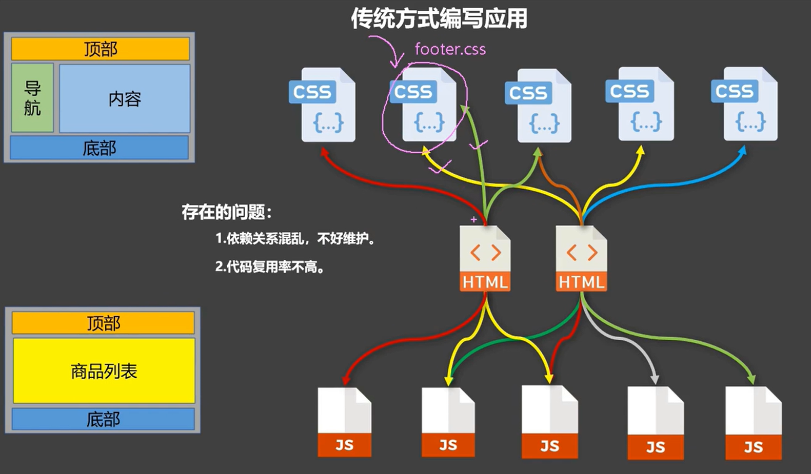

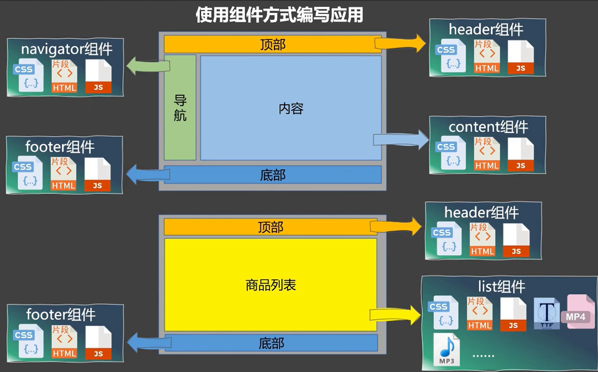


組件的定義：實現應用中**局部**功能**代碼**和**資源**的**集合**

## 054 非單文件組件

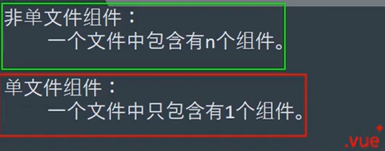

實際情況都會用**單文件組件**(以.vue結尾的)

### 創建組件 Vue.extend

幾乎與new Vue({}) 創建vue實例一樣功能，但不會亦不能以`el:#root`綁死一個模板，以保留其**複用靈活性**

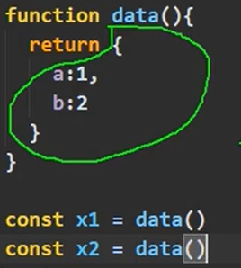

(在vue.extend裡寫，不要寫匿名函數)函數式寫data可以令x1,x2的a,b值分離，因data()各自為x1,x2創建了object

### 1. 創建組件school和student

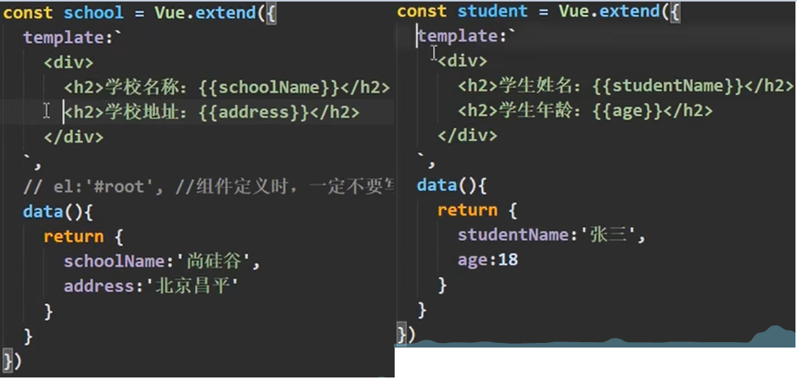

### 2. 註冊組件

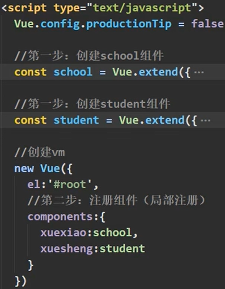

### 3. 編寫組件標籤

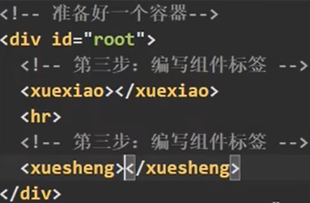

```
//全局註冊組件
Vue.component('hello',hello)
```

### 總結

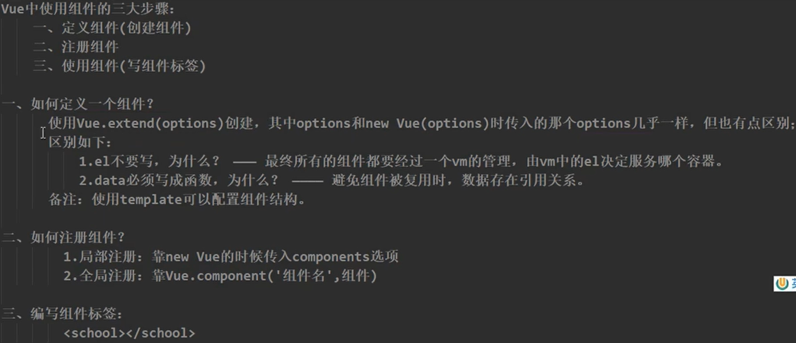

## 055 組件的注意點


## 056 組件的嵌套


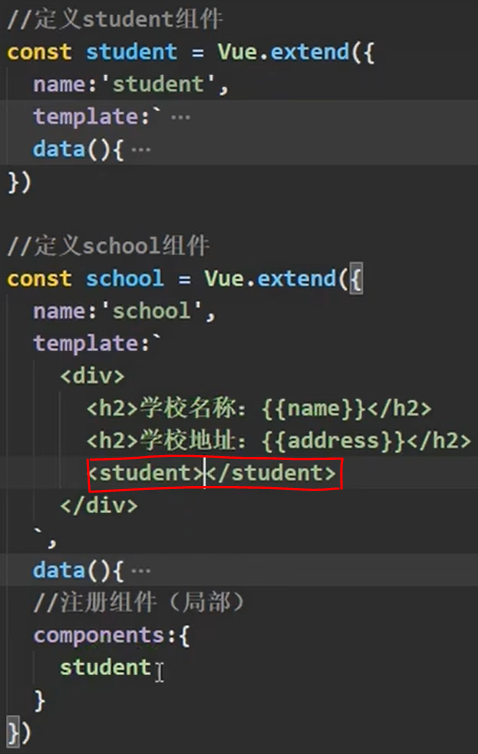

標準寫法：**利用一個大app 管理所有components**

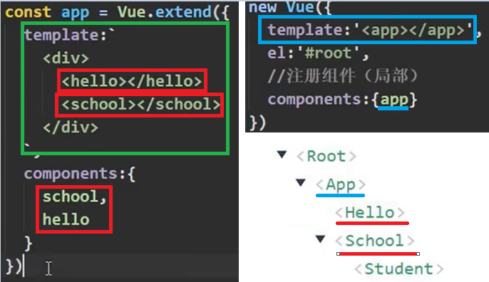

## 057 VueComponent構造函數

組件的本質是個函數，vc是由VueComponent構造函數new出來的

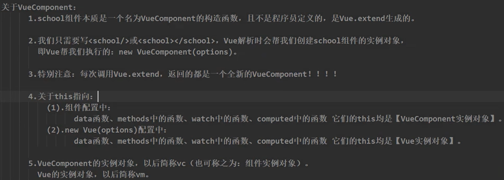

### vm管理著多個vc


## 058 059 Vue實例與VC實例的重要關係

vm跟vc的options基本一致，但有兩個差別：

- vc不能寫el

- vc的data必須用函式寫法(**複用vc時才能構造出不同的data object**)

### 鋪墊：函式原型對象

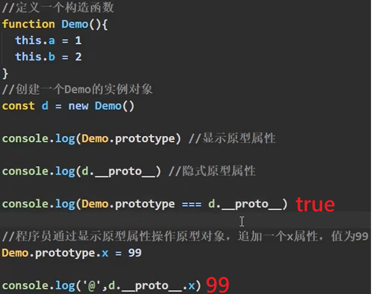

構造函數擁有**顯式原型屬性prototype**，實例擁有**隱式原型屬性__proto\_\_**

`d.__proto__`跟`Demo.prototype`指向同一物件

***實例的原型對象指向創造它的構造函數***

### Vue與VueComponent的關係


### 總結


## 60 單文件組件


### vue單文件組件的結構

`template`組件的結構

`script`組件交互的代碼(數據﹑方法等) **要export出去**，最好寫name

`style`組件的樣式


### App.Vue

別忘了用一個App.Vue包住，用來管理其他component


### main.js

建立main.js創建vue實例並引入App.Vue

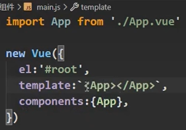

### index.html

準備一個容器，script放在容器下面，先讓模板出來再讓vue渲染

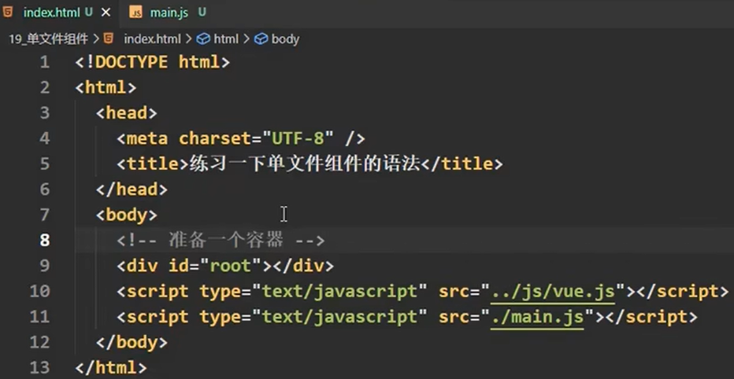

## 61 Vue CLI

CLI(command line interface) 用來編譯vue文件

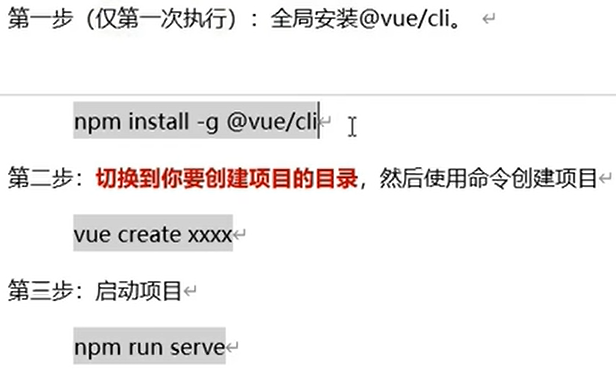

## 也可以用vite (大型項目不建議)

[vite教學](https://www.youtube.com/watch?v=FkVJCy3dao4&list=PLSCgthA1AnifSzKdpV4FWq1pLVF4FbZ4K) 

在CMD, 全局安裝yarn: `npm install -g yarn` 

在vscode terminal, 運行的資料夾建立vite:`yarn create vite`

> 如無法run yarn https://israynotarray.com/other/20200510/1067127387/

輸入project name, framework: `vue`, variant: `vue`

`yarn` 安裝需要的模組和函式庫

`yarn dev` 啟動vue專案

### 目錄結構

**yarn.lock** 記錄庫版本號，下次安裝會根據裡面的版本號安裝，並不會安裝最新的

**vite.config.js** vite設定

**package.json** 專案設定

- *scripts* 指令碼重新命名
- *dependencies* 記錄所需模組
- *devDependencies* 記錄開發所需模組，打包上線版時不會被打包

**node_modules/** 第三方模組 (.gitignore會ignore)

**public/favicon.ico** 靜態資源，不會被打包

**index.html** 首頁

**src/**

​	**main.js** index.html與App.vue的橋樑，mount('#app')

​	**App.vue** 父組件(嵌套其他組件)

​	**assests/** 靜態資源，會被vite打包

​	**components** 其他組件

### 修改默認配置

!!因為我們用了vite，所以修改默認配置會在vite.conf.js

配置文檔 https://cn.vitejs.dev/config/shared-options.html

配置教學 https://ithelp.ithome.com.tw/articles/10270465

---

## 138 Vite


## 139 vue3 分析工程結構


`import {createApp} from 'vue'` 引入createApp

vue3的新寫法：`createApp(App).mount('#app')`


app是一個比vm更輕盈的實例
